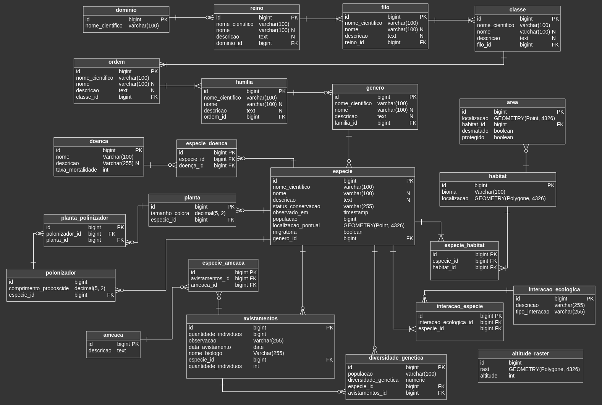

# Exercício Avaliativo - Banco de Dados - Catálogo de Seres Vivos

## Introdução
Este banco de dados armazena informações detalhadas sobre a classificação de seres vivos com conceitos de
[Classificação Científica](https://pt.wikipedia.org/wiki/Classifica) visando a conservação e estudo da [Biodiversidade](https://pt.wikipedia.org/wiki/Biodiversidade).
Para otimizar consultas, automatizar tarefas e garantir a consistência dos dados, aplicamos técnicas avançadas como constraints e índices para melhorar o desempenho 
e a integridade, views para facilitar o acesso, funções e triggers para automatizar processos, e enums para assegurar a consistência dos valores.

### Alunos

- [Alex Cesar](https://github.com/thealexcesar)
- [Emilly Santiago](https://github.com/emillysant)
- [Leonardo Raposo](https://github.com/Leo-Raposo)

---

  
Enunciado do Trabalho

## Modelagem
- [X] **Entidades**: Abstrair e criar tabelas para representar corretamente as necessidades que o exercício exige
- [X] **Atributos**: Incluir atributos detalhados como nome científico, nome comum, descrição, status de conservação, localização geográfica (geometry), data e hora de observações, tipo de interação ecológica, etc.
- [X] **Relacionamentos**: Estabelecer relações hierárquicas entre os níveis taxonômicos e relações complexas como ocorrência de espécies em habitats, doenças que acometem espécies e interações ecológicas.
- [X] **Tipos de Dados**: Utilizar tipos de dados adequados como geometry para localização geográfica, timestamp para data e hora.

## Funcionalidades
- [X] **Consultas**: Realizar consultas para obter informações sobre a distribuição geográfica de espécies, a riqueza de espécies em um habitat, as doenças que acometem uma espécie específica, entre outras.
- [X] **Triggers**: Implementar triggers para automatizar tarefas como atualizar o status de conservação de uma espécie quando a população diminui abaixo de um determinado limite, registrar o histórico de alterações nos dados e gerar alertas para espécies ameaçadas.
- [X] **Views**: Criar views para facilitar a visualização de dados complexos, como a lista de espécies endêmicas de um país ou a riqueza de espécies em um bioma.
- [X] **Funções**: Desenvolver funções personalizadas para realizar cálculos complexos, como a diversidade de espécies em uma área ou a distância entre dois pontos geográficos.

## Considerações
- [X] **Normalização**: Aplicar as regras de normalização para garantir a integridade dos dados.
- [X] **Índices**: Criar índices adequados, incluindo índices espaciais, para otimizar as consultas.
- [X] **Constraints**: Utilizar constraints para garantir a consistência dos dados.
- [X] **Documentação**: Gerar uma documentação completa do banco de dados, incluindo diagramas ER e descrições detalhadas das tabelas, colunas e relacionamentos.

## Consultas Necessárias
### Distribuição Geográfica e Ecologia
- [X] Quais espécies de aves migratórias passam pela Amazônia brasileira?
- [X] Qual a densidade populacional de onças-pintadas em áreas protegidas do Cerrado?
- [X] Quais espécies de plantas são endêmicas da Mata Atlântica e estão ameaçadas de extinção?

### Doenças e Saúde Animal
- [X] Quais doenças acometem principalmente primatas em áreas de desmatamento?
- [X] Qual a taxa de mortalidade por determinada doença em uma espécie específica?

### Evolução e Filogenia
- [X] Quais são os gêneros mais diversos da família Felidae?

### Monitoramento e Conservação
- [X] Qual a evolução da população de uma espécie ao longo dos anos?
- [X] Quais são as áreas prioritárias para conservação de uma determinada espécie?

## Casos de Uso para Guia do Projeto
- [X] **Biólogo Estudando a Impacto do Desmatamento em Primatas**:
  - Observou uma diminuição drástica na população de macacos bugios em áreas de floresta fragmentada.
  - Consulta: "Quais doenças emergentes estão associadas a primatas em áreas de desmatamento e qual a taxa de mortalidade dessas doenças?"

- [X] **Bióloga Estudando a Distribuição Geográfica de Uma Espécie Invasora**:
  - Identificou uma nova população de uma espécie de peixe exótico em um rio de uma bacia hidrográfica antes não registrada.
  - Consulta: "Quais outras espécies nativas coexistem com essa espécie invasora e quais as possíveis interações ecológicas?"

- [X] **Biólogo Conservacionista Analisando o Status de Conservação de Répteis**:
  - Notou uma diminuição nas populações de diversas espécies de serpentes em uma região de caatinga.
  - Consulta: "Quais espécies de serpentes da caatinga estão listadas como vulneráveis ou em perigo de extinção e quais as principais ameaças a essas espécies?"

- [X] **Biólogo Evolutivo Estudando a Diversificação de Aves**:
  - Hipótese: As aves de uma determinada família se diversificaram mais rapidamente em áreas montanhosas.
  - Consulta: "Qual o número de espécies por gênero em uma determinada família de aves em diferentes altitudes?"

- [X] **Biólogo Molecular Estudando a Diversidade Genética de Uma Espécie**:
  - Objetivo: Comparar a diversidade genética de populações isoladas de uma espécie de mamífero.
  - Consulta: "Qual a média de diversidade genética para cada população de uma determinada espécie?"

- [X] **Estudando a Relação entre Mudanças Climáticas e Distribuição de Espécies**:
  - Hipótese: Espécies de alta montanha estão migrando para altitudes menores devido ao aquecimento global.
  - Consulta: "Qual a mudança média na altitude das populações de uma espécie de ave de montanha nos últimos 50 anos?"

- [X] **Analisando a Eficácia de Áreas Protegidas**:
  - Questão: As áreas protegidas estão sendo eficazes em proteger espécies ameaçadas?
  - Consulta: "Qual a taxa de declínio populacional de espécies ameaçadas dentro e fora de áreas protegidas?"

- [X] **Investigando a Coevolução entre Plantas e Polinizadores**:
  - Hipótese: Plantas e seus polinizadores coevoluíram, desenvolvendo características morfológicas complementares.
  - Consulta: "Qual a relação entre o tamanho da corola de uma flor e o comprimento da probóscide de seus polinizadores?"

- [X] **Analisando a Diversidade Microbiana em Diferentes Ambientes**:
  - Objetivo: Comparar a diversidade de bactérias em solos de diferentes tipos de floresta.
  - Consulta: "Qual a riqueza de espécies bacterianas em solos de mata atlântica e amazônica?"

- [X] **Estudando o Impacto de Pesticidas na Fauna Aquática**:
  - Questão: Quais são os efeitos de diferentes pesticidas na abundância de invertebrados aquáticos?
  - Consulta: "Qual a redução na abundância de macroinvertebrados em rios próximos a áreas agrícolas?"

---

## Modelagem

### Entidades e Atributos
- **Entidades**: 
  - As tabelas representam diferentes níveis [taxonomônicos](https://pt.wikipedia.org/wiki/Taxonomia) e outros aspectos relacionados aos seres vivos.
- **Atributos**:
  - Incluem nome científico, nome comum, descrição, status de conservação, localização geográfica (geometry), data e hora de observações, tipo de interação ecológica, entre outros.

## Diagrama de Modelagem de Dados

### Estrutura das Tabelas Principais

#### Tabela [domínio](https://pt.wikipedia.org/wiki/Dom%C3%ADnio)
- **Descrição**: Armazena os domínios da vida, categorias mais amplas na taxonomia.
  

  
Colunas

  
  - `id`: Número único para identificar cada domínio.
  - `nome_cientifico`: Nome científico do domínio (ex.: 'Eukarya', 'Bacteria').

#### Tabela [reino](https://pt.wikipedia.org/wiki/Reino)
- **Descrição**: Armazena os reinos dentro de cada domínio.
  

  
Colunas

  
  - `id`: Número único para identificar cada reino.
  - `nome_cientifico`: Nome científico do reino.
  - `nome`: Nome comum do reino.
  - `descricao`: Descrição do reino.
  - `dominio_id`: Chave estrangeira que indica a qual domínio o reino pertence.

#### Tabela [filo](https://pt.wikipedia.org/wiki/Filo)
- **Descrição**: Armazena os filos dentro de cada reino.
  

  
Colunas

  
  - `id`: Número único para identificar cada filo.
  - `nome_cientifico`: Nome científico do filo.
  - `nome`: Nome comum do filo.
  - `descricao`: Descrição do filo.
  - `reino_id`: Chave estrangeira que indica a qual reino o filo pertence.

#### Tabela [classe](https://pt.wikipedia.org/wiki/Classe)
- **Descrição**: Armazena as classes dentro de cada filo.
  

  
Colunas

  
  - `id`: Número único para identificar cada classe.
  - `nome_cientifico`: Nome científico da classe.
  - `nome`: Nome comum da classe.
  - `descricao`: Descrição da classe.
  - `filo_id`: Chave estrangeira que indica a qual filo a classe pertence.

#### Tabela [ordem](https://pt.wikipedia.org/wiki/Ordem)
- **Descrição**: Armazena as ordens dentro de cada classe.
  

  
Colunas

  
  - `id`: Número único para identificar cada ordem.
  - `nome_cientifico`: Nome científico da ordem.
  - `nome`: Nome comum da ordem.
  - `descricao`: Descrição da ordem.
  - `classe_id`: Chave estrangeira que indica a qual classe a ordem pertence.

#### Tabela [familia](https://pt.wikipedia.org/wiki/Fam%C3%ADlia_(biologia))
- **Descrição**: Armazena as famílias dentro de cada ordem.
  

  
Colunas

  
  - `id`: Número único para identificar cada família.
  - `nome_cientifico`: Nome científico da família.
  - `nome`: Nome comum da família.
  - `descricao`: Descrição da família.
  - `ordem_id`: Chave estrangeira que indica a qual ordem a família pertence.

#### Tabela [genero](https://pt.wikipedia.org/wiki/G%C3%A9nero_(biologia))
- **Descrição**: Armazena os gêneros dentro de cada família.
  

  
Colunas

  
  - `id`: Número único para identificar cada gênero.
  - `nome_cientifico`: Nome científico do gênero.
  - `nome`: Nome comum do gênero.
  - `descricao`: Descrição do gênero.
  - `familia_id`: Chave estrangeira que indica a qual família o gênero pertence.

#### Tabela [especie](https://pt.wikipedia.org/wiki/Esp%C3%A9cie)
- **Descrição**: Armazena as espécies dentro de cada gênero.
  

  
Colunas

  
  - `id`: Número único para identificar cada espécie.
  - `nome_cientifico`: Nome científico da espécie.
  - `nome`: Nome comum da espécie.
  - `descricao`: Descrição da espécie.
  - `status_conservacao`: Status de conservação da espécie (ex.: 'Em Perigo', 'Vulnerável').
  - `populacao`: População estimada da espécie.
  - `criado_em`: Data de criação do registro.
  - `atualizado_em`: Data da última atualização do registro.
  - `genero_id`: Chave estrangeira que indica a qual gênero a espécie pertence.
  - `migratoria`: Indica se a espécie é migratória.
  - `localizacao_pontual`: Localização geográfica da espécie.

### Relacionamentos Entre as Tabelas
- **dominio -> reino**: Um domínio deve ter pelo menos um reino.
- **reino -> filo**: Um reino deve ter pelo menos um filo.
- **filo -> classe**: Um filo deve ter pelo menos uma classe.
- **classe -> ordem**: Uma classe deve ter pelo menos uma ordem.
- **ordem -> familia**: Uma ordem deve ter pelo menos um família.
- **familia -> genero**: Uma família pode ter muitos gêneros.
- **genero -> especie**: Um gênero pode ter muitas espécies.

## Tecnologias Utilizadas
- [Vertabelo](https://my.vertabelo.com/drive): Utilizado para a modelagem do banco de dados.
- [PostgreSQL](https://www.postgresql.org/): SGBD - Banco de dados relacional utilizado para armazenar os dados.
- [PostGIS](https://postgis.net/): Extensão do PostgreSQL utilizada para trabalhar com dados geográficos (Geometry).

## Referências
- [IUCN Red List of Threatened Species](https://www.iucnredlist.org/);
- [WWF Brasil](https://www.wwf.org.br/);
- [Prepara Enem](https://www.preparaenem.com/geografia/biomas-brasil.htm);
- [Catalogue of Life](https://www.catalogueoflife.org/);
- [Technical Documentation](https://techdocs.gbif.org/en/);
- [Youtube](https://www.youtube.com/);
- [Google Maps](https://www.google.com/maps/);
- [PostgreSQL Documentation](https://www.postgresql.org/docs/current/);
- [PostGIS Manual](https://postgis.net/docs/manual-3.4/using_postgis_dbmanagement.html#Point);
- [PostgreSQL Tutorial](https://www.postgresqltutorial.com/);
- [pgPedia](https://pgpedia.info/).
